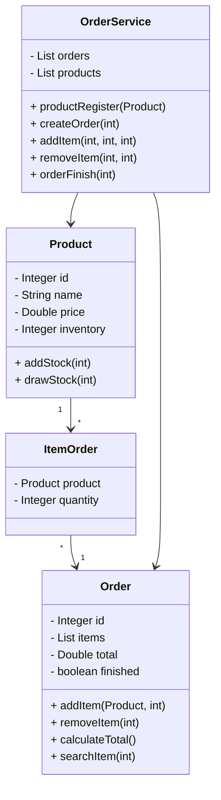

# 🍔 Delivery Order System

Sistema de gerenciamento de pedidos para delivery desenvolvido em **Java**, com foco em **Programação Orientada a Objetos (POO)**, tratamento de exceções e organização em camadas.

---

## 📌 📖 Sobre o Projeto

Este projeto simula o funcionamento de um sistema de delivery, permitindo:

* Cadastro de produtos
* Controle de estoque
* Criação de pedidos
* Adição e remoção de itens
* Finalização de pedidos
* Listagem de pedidos e produtos

Toda a aplicação foi estruturada seguindo boas práticas de **separação de responsabilidades**, utilizando pacotes como:

```
model.entities
model.services
model.exceptions
application
```

---

## 🧠 🚀 Conceitos Aplicados

* Programação Orientada a Objetos (POO)
* Encapsulamento
* Tratamento de Exceções
* Regras de Negócio
* Estrutura em Camadas
* Manipulação de Listas (`List`)

---

## 🧱 📦 Estrutura do Projeto

```
com.systemdelivery
│
├── application
│   ├── Program.java
│   └── Menu.java
│
├── model
│   ├── entities
│   │   ├── Product.java
│   │   ├── Order.java
│   │   └── ItemOrder.java
│   │
│   ├── service
│   │   └── OrderService.java
│   │
│   └── exceptions
│       └── (exceções personalizadas)
```

---

## 📊 🧩 Diagrama UML



---

## 🖥️ 🧾 Menu do Sistema

```
1 - Register product
2 - New order
3 - Add item to order
4 - Remove item from order
5 - Order finish
6 - List orders
7 - List products
0 - Exit
```

---

## ⚠️ 🚨 Tratamento de Exceções

O sistema utiliza exceções personalizadas para garantir regras de negócio, como:

* Produto já existente
* Pedido já existente
* Produto não encontrado
* Estoque insuficiente
* Pedido finalizado

---

## 🎯 🎓 Objetivo

Projeto desenvolvido com fins acadêmicos para praticar:

* Modelagem de sistemas
* Organização de código
* Aplicação de conceitos de POO em Java

---

## 👨‍💻 Autor

Desenvolvido por [Jose Netto](https://www.linkedin.com/in/josednetto/)
